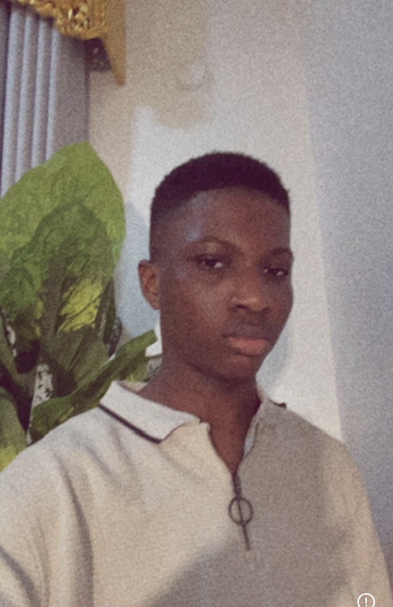
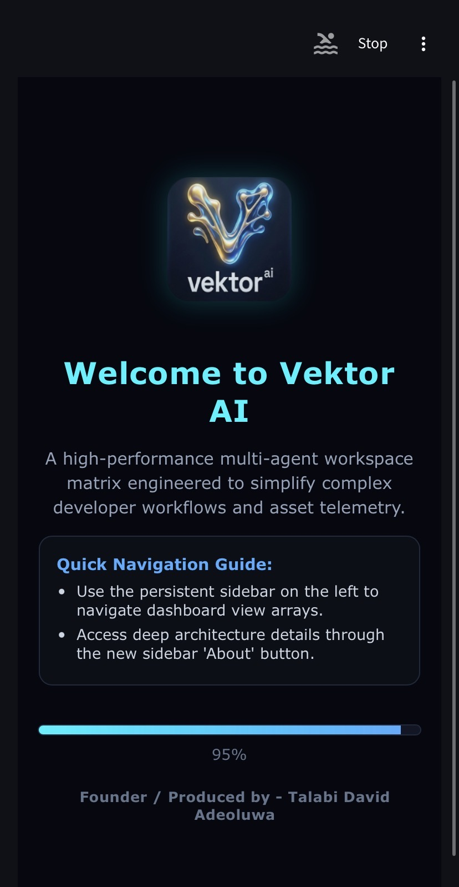
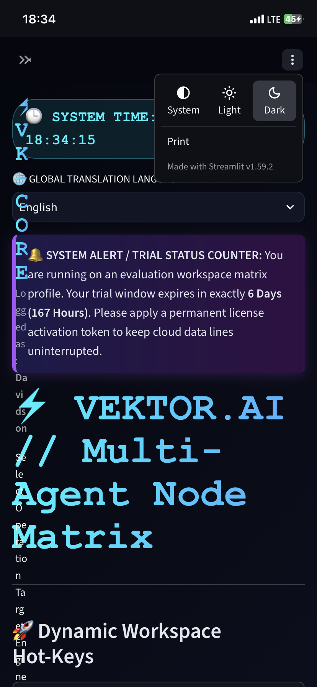
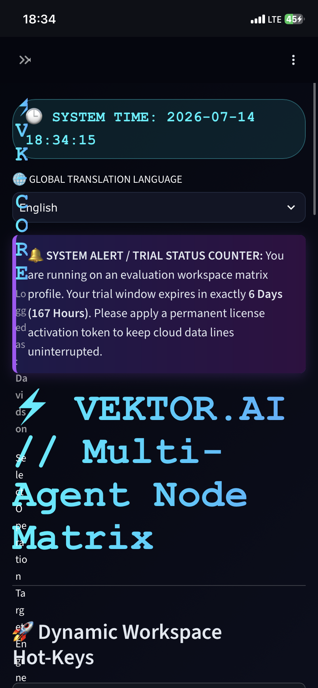
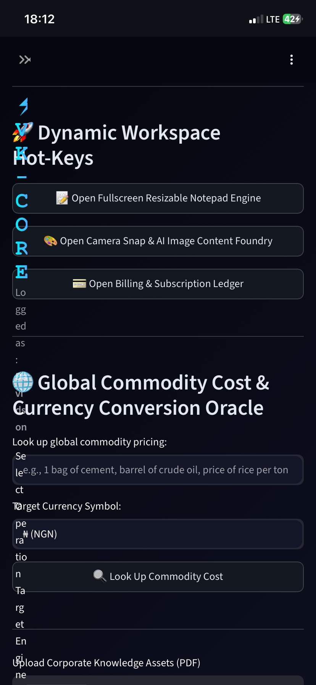
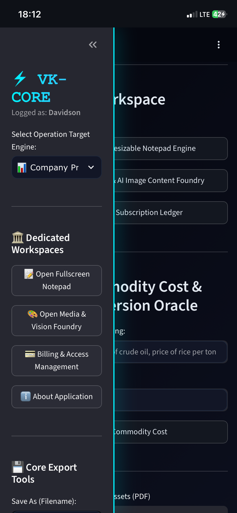
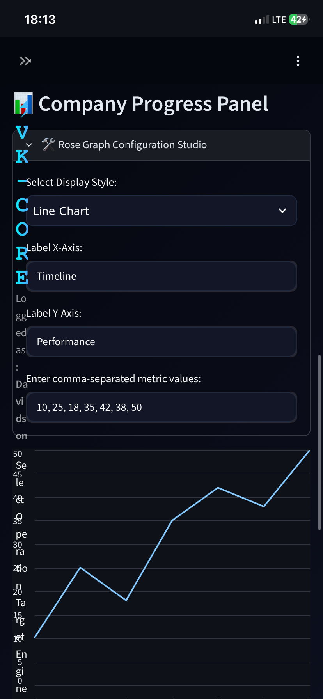

# Talabi David Adeoluwa

I am a programmer, a young engineer, and the owner and creator of the **Vektor AI** app. I also work in civil engineering—bringing structured, analytical, and practical problem-solving to both the digital and physical worlds.

---

## 👨‍💻 About Me
Below is my developer profile picture:

---

## 🚀 About My App (Vektor AI)
Vector AI is an intelligent application designed to streamline workflows, deliver smart insights, and provide a seamless user experience. 

  

### 📊 App Interface & Workspaces
Here is a complete look at the Vektor AI interface, workspaces, and performance graphs:

| **Main Interface** | **Dynamic Workspace** |
|:---:|:---:|
|  |  |

| **Company Progress Panel** | **Analytics Dashboard** |
|:---:|:---:|
|  |  |

| **Additional View** |
|:---:|
|  |

### 🔗 Try the Live App
Click the link below to run the application live on Render:
👉 **[CLICK HERE TO USE VECTOR AI](https://my-vector-ai-app.onrender.com)**

---

*Developed by Talabi David Adeoluwa. All rights reserved.*
